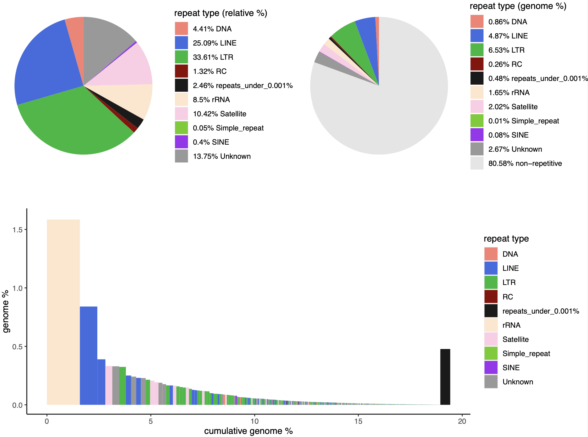
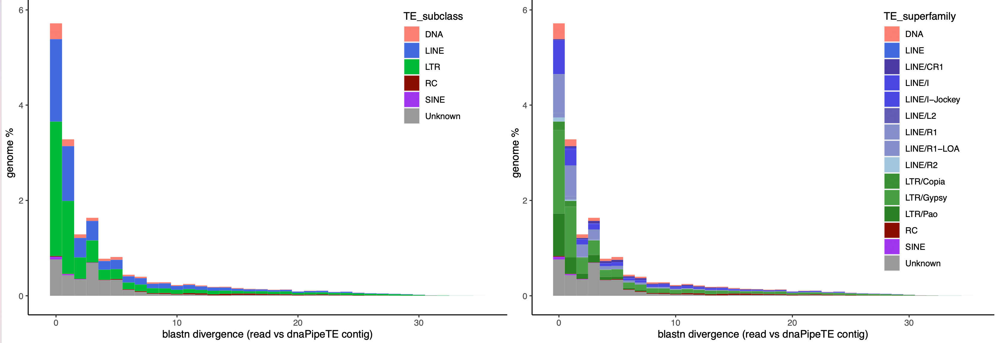

# dnaPT_utils

dnaPT_utils is a collection of scripts to perform multiple downstream analyses with [dnaPipeTE 1.3](https://github.com/clemgoub/dnaPipeTE)
I recommend to use this tools to replace the graphs automatically produced by the pipeline.

- [`dnaPT_charts.sh`](#dnapt_chartssh): plots the relative repeat proportions (2 piecharts) and the quantification of each assembled repeat (barplot).
- [`dnaPT_landscapes.sh`](#dnapt_landscapessh): plots an histogram representing the blastn divergence mesured between each read and the assembled repeats.
- `dnaPT_compare.sh`: perform a comparative analysis of the relative abundance of shared repeat families between two datasets.

## dnaPT_charts.sh

This script processes an output folder of dnaPipeTE v1.3 and produces 3 graphs:
- Piechart 1 (left): relative proportions of the different repeat categories.
- Piechart 2 (right): proportion of the different repeat categories relative to the total genome.
- Barplot (bottom): genomic proportion of each dnaPipeTE contig and the associated classification.
	- A threshold `-t` (% genome) can be set such as contigs representing < t% of the genome will be groupped together.


> *You will note that the piecharts may provide slightly different values than originaly. Indeed, the piechart directly available after a dnaPipeTE run is based on the counts of 2 successive blastn again (1) the classified repeats in `Trinity.fasta` and (2) the unclassified ones (these counts can be found in `Counts.txt`). This was originaly designed to increase sensitivity at the subclass level. However, it turns out to be confusing without providing  substantial improvement. With this script, the piecharts are now directly made from the results of one single blastn of the reads against the whole `Trinity.fasta` file, which is also used to create the detailed count table `reads_per_components_and_annotation` as well as the landscape analysis.*

### Dependencies:
- `R` + packages `ggplot2`, `tidyverse` and `cowplot` (https://www.r-bloggers.com/2010/11/installing-r-packages/)

### Usage: 

```
./dnaPT_charts.sh -I <dataset_directory> [options]


mendatory arguments:
 -I, --input-dir              dnaPipeTE output directory

options:
 -p, --prefix                 prefix to append to the output filename: "<prefix>_charts.pdf"
 -t, --percent_threshold      barplot: repeats < -t % are groupped together as a single category (default 0.001%)
 -o, --output                 output folder (path); default: dnaPipeTE output directory
 -y, --ylim                   Max value for the y axis (genome %) [0-100]
 -h, --help                   Prints this message and exit
 ```

## dnaPT_landscapes.sh

This script perform at "TE landscape" analysis, i.e., it plots an histogram of the blastn divergence between raw reads (TE copies in the genomes) and their consensus sequences assembled in the file `Trinity.fasta`. The script plots only putative TE sequences among the subclasses "LINE", "SINE", "LTR", "DNA", "RC" and "Unknown" (a.k.a. "NA"). 

### Dependencies:
- R + packages `ggplot2` and `tidyr`


### Usage: 

```
./dnaPT_landscape.sh -I <dataset_directory> [options]

mendatory arguments:
 -I, --input-dir              dnaPipeTE output directory

options:
 -p, --prefix                 prefix to append to the output filename: "<prefix>_landscapes.pdf"
 -o, --output                 output folder (path); default: dnaPipeTE output directory
 -S, --superfamily            Plot with superfamily information (instead of subclass)
 -y, --ylim                   Max value for the y axis (genome %) [0-100]
 -U, --no-unknown             Remove unclassified repeats
 -h, --help                   Prints this message and exit
```


## dnaPT_compare.sh

This script measures the relative abundance of shared TE families between two datasets analyzed with dnaPipeTE. 
   
1 - Shared families are identified by clustering together the repeat sequences ("`Trinity.fasta`") of each dataset. The clustering is performed with `cd-hit-est` with the parameters described in Goubert et al, 2021 (Mobile DNA, in press) and approximate the "80-80-80" rule. 
   
2 - Shared families are identified by selecting clusters where sequences from both dataset A and B are present. For each cluster, the counts (in bp) and genome % are summed per dataset to obain a quantification of each shared family. The classification of a shared repeat is taken from the representative sequence of each cluster, and correspond to the longest sequence in the cluster. It can either come from dataset A or B. 
   
3 - The abundances of each shared family, either in % genome or equivalent copy, are then plotted with R/ggplot2.

>*I recommend to use caution while interpreting results with low quantities, typically < 0.01% or < 1 equivalent copy. Thresholds options are available (-p / -e) to filter the plotted data.*
   
### Dependencies:

- CD-HIT (https://github.com/weizhongli/cdhit)
- R + packages `ggplot2`, `scales`, `tidyr` and `reshape2` 

### Usage: 

```
./dnaPT_compare.sh -A <dataset_A_directory> -a <prefix_A> -B <dataset_B_directory> -b <prefix_B> -o <output_folder> [options]

mendatory arguments:
 -A, --dir_A                  dnaPipeTE output directory for dataset A (path)
 -B, --dir_B                  dnaPipeTE output directory for dataset B (path)
 -a, --pref_a                 prefix for dataset A (string)
 -b, --pref_b                 prefix for dataset B (string)
 -o, --output                 output folder (path)

options:
 -T, --te_only                Only plot repeats of the sub-classes "LINE", "SINE", "LTR", "DNA", "RC" and "Unknown"
 -S, --superfamily            Plot with superfamily information (instead of Class)
 -p, --percent_threshold      min. percent genome to plot (default = 0) / not used if -E/-ecp selected
 -E, --ecp                    perform comparison in equivalent copy (dataset counts in bp / representative sequence size)                              
 -e, --ecp_threshold          min. equivalent copy/ies to plot (default = 0)

 -h, --help                   Prints this message and exit
```
> *Caution: the length used for normalization in "equivalent copy" mode (`-E/--ecp`) is based on the length of the representative sequence of each cluster, which originate from either one of the two dataset compared. It is thus assumed that the consensus length is the same in each species/sample, which is not necessarily true.*